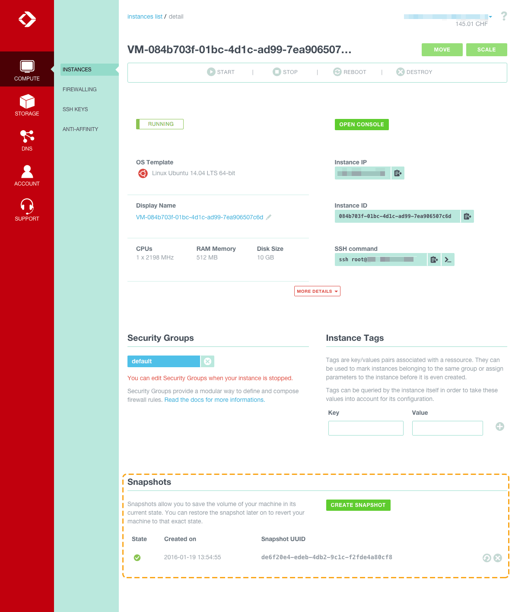

Snapshots provide a way to get point-in-time recovery for your Instance.
In a typical usage example you would Snapshot your Instance before applying patches. Once the patches are installed, if your tests are not satisfying or an eventual incompatibility is introduced, you can revert to the Snapshot and restore the previous working state.

## Create a new Snapshot
From the Instance detail screen, click on `Create Snapshot` to create a new Snapshot. A successfully created Snapshot has a green check-mark on his left.

## Revert to a Snapshot
To revert a Snapshot your machine has to be stopped. From the Snapshots list, in the Instance detail, click on the revert button on the line of the Snapshot you wish to revert.

## Delete a Snapshot
In the Instance details view, select the Snapshot you want to delete and
click on `Delete Snapshot` to delete it.

## Limits
* Snapshots are limited to 30 per Account. Please contact support should you
  need more.
* Only one action is permitted at a time. For example, when a Snapshot is
  being destroyed, you cannot create a new Snapshot.
* Snapshots cannot be named at the moment, they are identified by a UUID.

