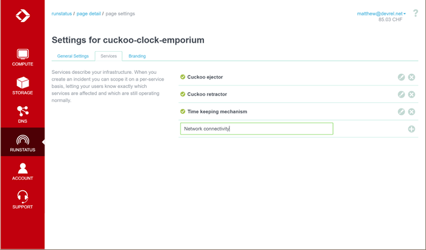
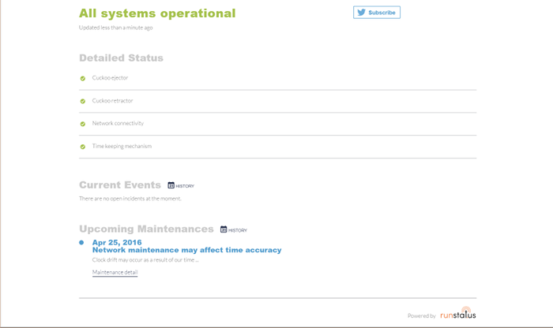

Runstatus is a hosted status page that lets you communicate your application's:

 * current status
 * planned maintenance.
 
In this quick-start, you'll learn how to:

 * tell Runstatus about the different components that make up your application
 * brand your Runstatus page
 * allow Runstatus to post updates to your chosen Twitter account
 * use the web interface to:
	* post a service status update
	* schedule and announce a maintenance window
 * use finger to query the status of an application from your terminal
 * use a custom domain.

We'll describe how to use the Runstatus API in the next iteration of this guide.

## Setting up your status page

To set up your status page you first need to log into your [Exoscale console](https://portal.exoscale.ch/). 

**Note:** If you already have an Exoscale account, you can start using Runstatus straight away. If you don't yet have an Exoscale account, you can [register for Runstatus](https://runstatus.com/) now. 

Once you're logged in, click the *Runstatus* icon in the left-hand menu and then name your new status page. The name you choose:

 * cannot change once you click *Create*
 * will form the sub-domain for your status page
 * must follow standard domain name rules: only letters, numbers and dashes are allowed and it must start with a letter or a number.
	
### General settings

Next you can specify the basic settings for your status page, including:

 * timezone: start typing in the format Continent/City: e.g. Europe/Zurich
 * the Twitter account where you want Runstatus to post your system status updates
 * a human-friendly name to display on your status page
 * a custom domain to be able to use your own domain.
 
### Describing your services

Every application has distinct components whose availability can affect user experience.

Under the *Services* tab you can specify those components. What you specify here should be a reflection of how your application's users experience your service rather than a detailed listing of your system architecture.

For example, if you have two redundant database clusters then losing one of those clusters might not take your application offline but it could reduce performance. Rather than listing each database cluster individually you might help your users more by listing a single "Database" component.

Even more useful would be to think in terms of what the users would lose in the event of an incident. Rather than "Database" you might list the services that the database supports: for example, "User profiles and account login", "Widget directory", "User to user messaging".

You can add to, edit or delete these components at any time.

### Branding

To brand your page, you can specify:

 * a logo (PNG or JPG at 200px square)
 * a header (PNG or JPG, landscape)
 * page colours.
 
### Your status page

When you have no open incidents Runstatus will display your chosen default status message and a green tick for each component you've specified.

When there is an ongoing incident Runstatus will show the most recent status update and a yellow (partial outage) or red (major outage) icon beside each affected component. Your users can then click-through for the full event timeline.

When you have maintenance scheduled, Runstatus lists its date and description with a link to more detail.

 
## Posting an update using the web interface

You can post two types of service update:

 * an ongoing, unplanned, incident
 * a maintenance period planned for a future time and date.
 
### Ongoing incidents

To create a new ongoing incident, click the red *Add incident* button.

Here you need to:

 * Specify the level of interruption users will notice.
 * Provide a title for the incident.
 * Briefly describe the incident (the title and this description will form the tweet that Runstatus posts about this incident).
 * Specify the current status of the incident.
 * Select which of your application's services are affected.
 
Once you've clicked the *Post new incident* button, Runstatus will:

 * Tweet the incident to the account you specified.
 * Update your application's Runstatus page with the details you've given.
 * Consider this update as the first event of the incident.
 
#### Updating an ongoing incident

As the incident evolves, you should post new events to your incident timeline.

Runstatus adds each of these updates to the incident timeline on your public status page and also posts them to your linked Twitter account.

To mark an incident as fixed, post a new event with a status of *Operational*.

### Scheduled maintenance

To announce scheduled maintenance, click the blue *Add maintenance* button.

Here you can specify:

 * the start time and date (in the timezone you specified in your status page setting)
 * the end time and date
 * the title and description of the maintenance (used as the tweet text)
 * the services affected.

A maintenance period's status is automatic: once you post an event to the maintenance period's timeline then it is marked as *In progress*. When you close the maintenance period, the status switches to *Complete*.

## History

Runstatus preserves the history of all your event timelines &mdash; both unplanned incidents and scheduled maintenance &mdash; on your status page. Click the *History* icons on your status page to see past timelines.

You can edit a completed incident's description, from within your Exoscale console, but you can't remove it from your status page and nor can you edit individual events.

## Querying service status from your terminal

You can query an application's status from your terminal, if you have the *finger* utility installed.

For example, to query Exoscale's own status, type:

		finger exoscale@runstat.us
		
You'll receive a response similar to this:

		[runstat.us]
		Service status:

		|        Service |       State |
		|----------------+-------------|
		| Object Storage | operational |
		|    Compute API | operational |
		|           Apps | operational |
		|        Compute | operational |
		|            DNS | operational |

		URL:  https://status.exoscale.ch

## Making more of Runstatus

You can post updates to your status page using the Runstatus API. Soon we'll
publish a new guide specifically about using that API.

## Enabling a custom domain

To use your own domain instead of `NAME.runstat.us` you can simply enter the
domain in the `General Settings` of your status page. Additionally your DNS
server needs to be configured to point your status domain to `NAME.runstat.us`
as CNAME entry.
